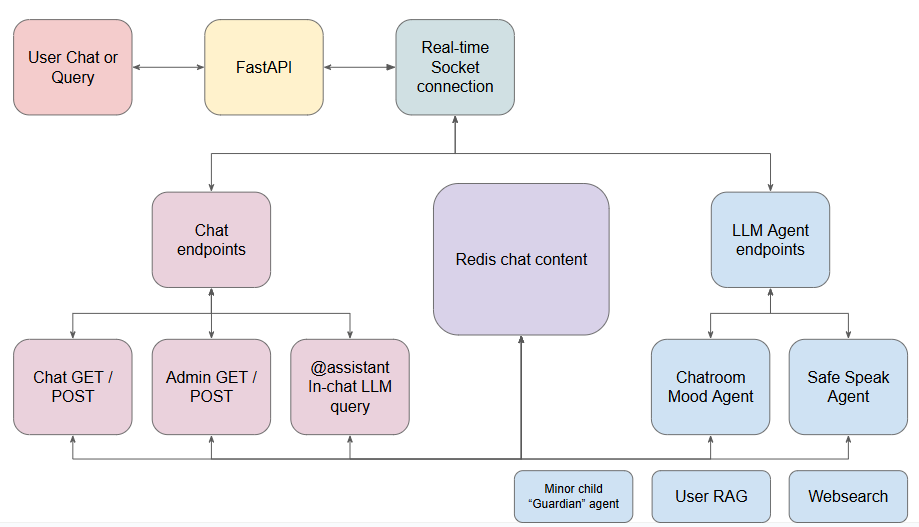
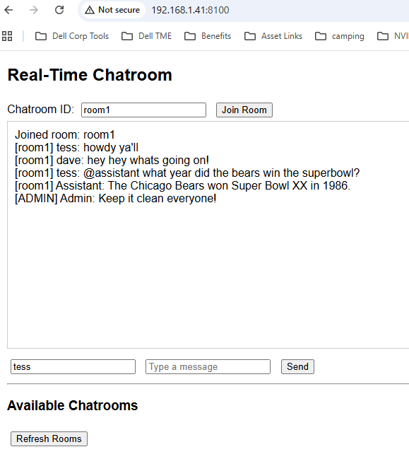
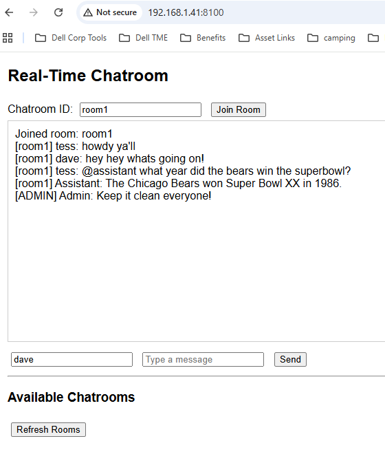
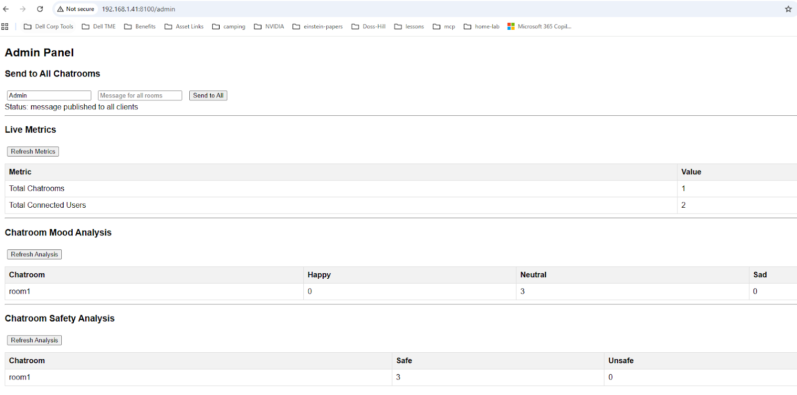
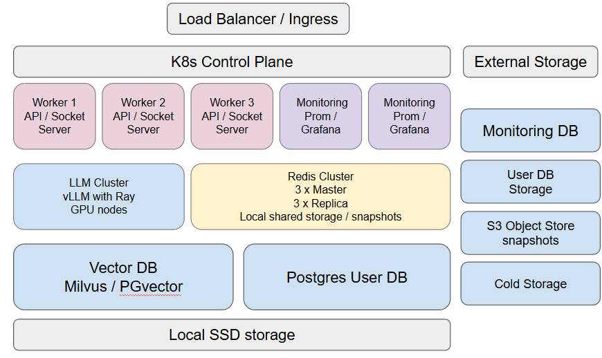

# Agentic AI Real-Time Chatroom

## Use Case / Problem Description

How do we increase value, boost user engagement, and reduce costs in a real-time chatroom environment with natural language task execution and moderation.

## Workflow Diagram





## Overview

Chatting with new friends can be an amazing experience; it can also be a terrible one. Safety, security, and low latency are key factors in designing a successful app in general, but for a chatroom these are particularly important. To shutter all speech would be much too intolerant, and allowing everything might be risky.

As the stewards of such a chatroom app, we want a space where we can be flexible enough to allow as much speech as possible, while being aware when mood or the speech trend is veering into undesirable topics.

It is too expensive to hire multiple moderators to judge each individual chatroom and each interaction. It also might feel too robotic to have a list of forbidden keywords that can be easily defeated by using acronyms or other substitute phrases instead. This is where an LLM shines with humanlike capabilities and agentic superpowers.

Agents are simply functions that employ an LLM to do useful tasks. In the chatroom experience we would create an array of moderation agents to help by checking mood, language, and topic. We can also create an array of concierge agents to help get things done within the chat such as creating new rooms, or listening for certain user-interest topics in other rooms or even a research assistant for getting information from the internet and bringing it into the chat.

## Getting Started

### Demo Deployment

The code in this repo is for a demo deployment of a small agentic real-time chatroom using Docker. The demo utilizes much of the same core technologies as you would find in a production version such as FastAPI, [Socket.io](http://socket.io), Redis, and LLM agents. For more information on launching the demo version, please see the instructions below.

### System Requirements:

  - Ubuntu 22.04
  - Python 3.10
  - Docker and docker compose
  - Locally hosted LLM (8b or higher) or cloud LLM, in this case Google API
  - Local hosted LLM will require Nvidia container toolkit as well as updated Nvidia drivers

### Demo Deployment Features:

  - **Real-Time Messaging**: Users can join and participate in various chatrooms with messages appearing instantly.
  - **Split message queues**: Dedicated Chat queue for lowest latencty and dedicated analysis queue.
  - **In-chat LLM Assistant**: simply type `@assistant` followed by your query to access the LLM directly in the chat.
  - **Persistent Chatrooms**: Chatrooms are stored in Redis, allowing them to persist even after all users have left.
  - **Live Admin Panel**: A dedicated admin interface that provides real-time insights into the chat network.
  - **Live Metrics**: Displays the total number of chatrooms and the total number of connected users.
  - **Mood Analysis Agent**: Analyzes each message for sentiment and provides a count of "happy," "sad," and "neutral" messages per chatroom.
  - **Safety Analysis Agent**: Classifies messages as "safe" or "unsafe," providing a crucial moderation tool.
  - **Admin Broadcast**: Allows an administrator to send a message to every chatroom simultaneously.

To deploy this application, you will need to have Docker and Docker Compose installed.

1.  **Get an API Key**: Obtain a Google API key from Google AI Studio. This key is required for the LLM analysis.
2.  **Create a .env file**: In the root directory of the project, create a `.env` file with the following content:
    ``` 
    GOOGLE_API_KEY=your_api_key_here
    SERVER_IP=your_server_ip  
    ```
3.  **Run with Docker Compose**: Execute the following command in your terminal. This will build the images and start all the services (API, Socket.IO server, and Redis) in the background.
    ``` bash
    docker compose up -d --build
    
    ```

4.  **Check logs**: Check the logs for each of the services first by checking the docker processes then checking log output.

   ```
docker ps 


3ab7f8623e05   backend-socket_server                                      "python main.py"         12 hours ago   Up 12 hours   0.0.0.0:5000->5000/tcp, [::]:5000->5000/tcp   backend-socket_server-1
e58c82faf125   backend-api                                                "uvicorn main:app --…"   12 hours ago   Up 12 hours   0.0.0.0:8100->8100/tcp, [::]:8100->8100/tcp   backend-api-1
88514691a283   redis:latest                                               "docker-entrypoint.s…"   12 hours ago   Up 12 hours   0.0.0.0:6379->6379/tcp, [::]:6379->6379/tcp   backend-redis-1
    ```

   ```
docker logs backend-socket_server

   ```


### Usage:

Once the application is running, you can access the following endpoints in your browser:

  - **User Interface**: Navigate to `http://localhost:8100` to access the main chatroom. Select the room you want.  The default room is "room1". Click JOIN and then enter a username and send a message to start.
  - **LLM assistant:** simply type `@assistant` (that's the @ symbol and the work assistant) followed by your query to access the LLM directly in the chat.
  - **Admin Panel**: Navigate to `http://localhost:8100/admin` to access the administrator dashboard. Here you can see live metrics and send broadcast messages to all users in all rooms.

### Project Structure:

``` 
.
├── backend/
│   ├── api/
│   │   ├── Dockerfile
│   │   ├── main.py
│   │   ├── requirements.txt
│   │   └── static/
│   │       ├── admin.html
│   │       └── index.html
│   ├── docker-compose.yml
│   ├── .env
│   ├── socket_server/
│   │   ├── Dockerfile
│   │   ├── main.py
│   │   └── requirements.txt
└── README.md

```

## Screenshots

### User Interface

  - 2 users in room1, Tess and Dave
  - In-chat LLM assistant query using “@assistant” flag
  - Admin broadcast ability







### Admin Dashboard:

  - Admin broadcast to all
  - Basic chatroom metrics
  - Mood analysis
  - Safety analysis





## Production Deployment

### Production Systems Reference Diagram





A production deployment would use Helm in a multi-node Kubernetes environment for high availability and pod auto-scaling. Various storage classes are made available for local block, object and file storage. GPU nodes are reserved for the LLM instances. A high-level view of what instances and pods are needed:

  - API cluster, API and Socket Server pods on same node with multiple nodes
  - Redis cluster, 3 nodes for redundant master and 3 nodes for replicas
  - LLM cluster, 2 models in each node, 2 nodes for redundancy.
      - Basic chat analysis model, smaller, quantized for speed / Llama 3 - 8b
      - Reasoning model for agents, larger / Llama 3 - 70b or better
      - Milvus used as a vector db as user RAG will inevitably be used in some form.
  - Monitoring cluster, multinode Prometheus and Grafana
  - Storage is a combination of local SSD, Object and Block storage.

### Testability

Since the individual major processes are broken out into their own separate containers, unit and integration testing is simplified. Pytest and some synthetic data can be used to test API health as well as LLM analysis results. I would suggest using a standalone non-HA dev environment deployed using Helm rather than mocking Redis and socket comms, this would in my opinion cause more trouble and introduce more errors to debug. Using a small dev cluster will ensure the test results are aligned to what is expected in the prod environment.

### Maintainability

I would suggest leveraging infrastructure as code as much as possible with tools like Helm, Ansible and Terraform when needed. Implement auto-scaling rules where necessary to keep human intervention to a minimum during low or peak resource needs. I would strive for repeatable, consistent environments along the entire stack from dev to prod.

For the codebase, the goal is to keep it modular and segregate logic into distinct components so that changes can be managed more effectively without taking down other components. API functions for both chat and LLM agents are brought in only when needed and can be reused as needed.

For monitoring infra and various chatroom metrics, I would suggest the Prometheus, Grafana and Alertmanager stack. These are reliable, low impact and proven in production. Alerts such as latency, error rates and resource usage are all possible, but we can also monitor LLM performance, token counts, mood and safety analytics.

### Security and Safety

To ensure user safety and overall security of PI and conversation data all conversations should be encrypted on the way in and out. Pod networks should be locked down to only allow traffic between pods and authorized services, nothing is left wide open and firewall policies are maintained and scanned from within and externally.

Minor age children must have parent permission with some sort of 2FA authentication to create and maintain an account. Safe language restrictions and perhaps a Guardian LLM agent can be leveraged to sniff out potential grooming or inappropriate situations with minors.

